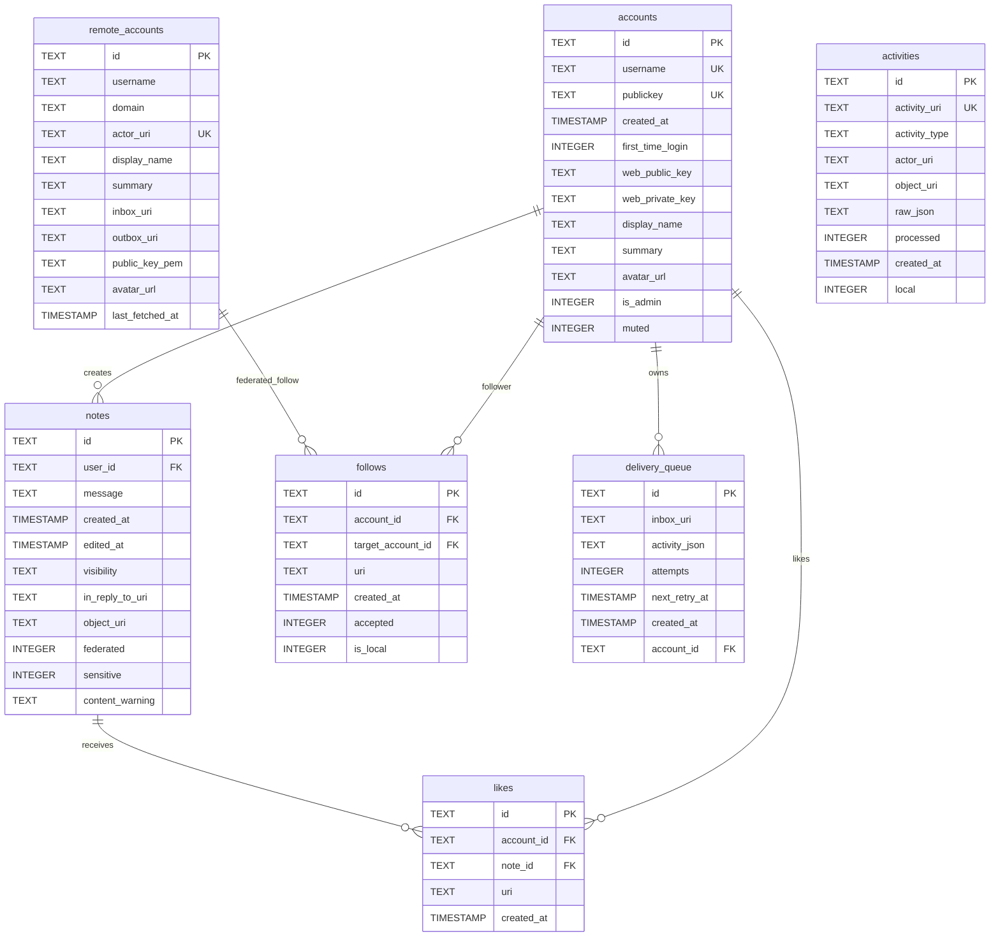

# Database Schema

Stegodon uses SQLite with WAL mode for data storage. The schema supports both local user management and ActivityPub federation.

## Entity Relationship Diagram

## Tables

### accounts
Local user accounts. Each user authenticates via SSH public key and has an RSA keypair for ActivityPub signing.

### notes
User-created posts. Supports visibility settings, content warnings, and federation status.

### follows
Follow relationships between accounts. Can represent local-to-local, local-to-remote, or remote-to-local follows.

### remote_accounts
Cached ActivityPub actors from other servers. Includes public keys for signature verification and inbox URIs for delivery.

### activities
Log of all ActivityPub activities (incoming and outgoing). Stores raw JSON for debugging and replay.

### likes
Like/favorite relationships between accounts and notes.

### delivery_queue
Background queue for federating activities to remote servers. Supports retry with exponential backoff.

## Indexes

| Table | Index | Columns |
|-------|-------|---------|
| accounts | idx_accounts_username | username (unique, case-insensitive) |
| notes | idx_notes_user_id | user_id |
| notes | idx_notes_created_at | created_at DESC |
| notes | idx_notes_object_uri | object_uri |
| follows | idx_follows_account_id | account_id |
| follows | idx_follows_target_account_id | target_account_id |
| follows | idx_follows_uri | uri |
| remote_accounts | idx_remote_accounts_actor_uri | actor_uri |
| remote_accounts | idx_remote_accounts_domain | domain |
| activities | idx_activities_uri | activity_uri |
| activities | idx_activities_processed | processed |
| activities | idx_activities_type | activity_type |
| activities | idx_activities_created_at | created_at DESC |
| likes | idx_likes_note_id | note_id |
| likes | idx_likes_account_id | account_id |
| delivery_queue | idx_delivery_queue_next_retry | next_retry_at |
