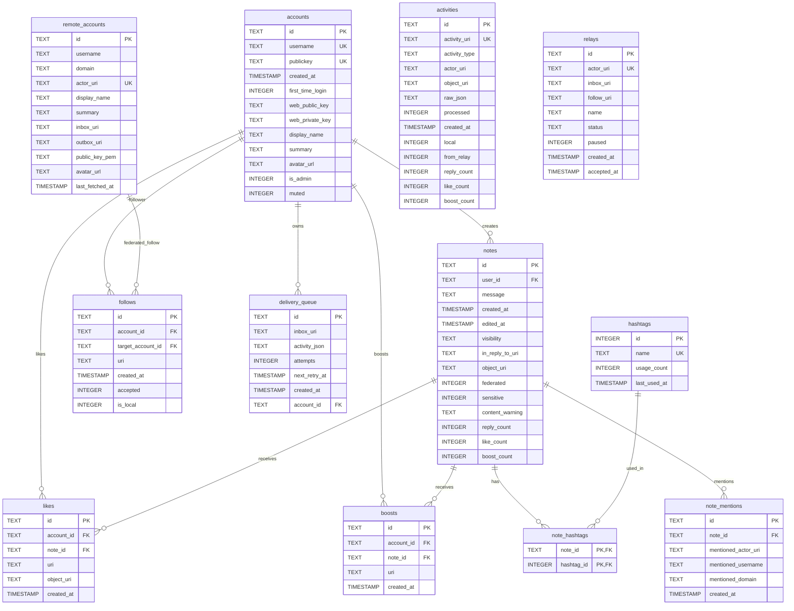

# Database Schema

Stegodon uses SQLite with WAL mode for data storage. The schema supports both local user management and ActivityPub federation.

## Entity Relationship Diagram

## Tables

### accounts
Local user accounts. Each user authenticates via SSH public key and has an RSA keypair for ActivityPub signing.

### notes
User-created posts. Supports visibility settings, content warnings, threading via `in_reply_to_uri`, and federation status. Includes denormalized engagement counters (`reply_count`, `like_count`, `boost_count`) for efficient display.

### follows
Follow relationships between accounts. Can represent local-to-local, local-to-remote, or remote-to-local follows. The `is_local` flag indicates whether the target is a local user.

### remote_accounts
Cached ActivityPub actors from other servers. Includes public keys for signature verification and inbox URIs for delivery. Cached data has a 24-hour TTL before refresh.

### activities
Log of all ActivityPub activities (incoming and outgoing). Stores raw JSON for debugging and replay. The `from_relay` flag indicates content forwarded via relay subscriptions. Includes denormalized engagement counters for remote posts displayed in timelines.

### likes
Like/favorite relationships between accounts and notes. For local notes, `note_id` references the note directly. For remote/federated posts, `object_uri` stores the ActivityPub object URI and `note_id` contains a deterministic placeholder UUID derived from the object URI (to satisfy the unique constraint).

### boosts
Boost/reblog relationships between accounts and notes. Created when receiving `Announce` activities.

### delivery_queue
Background queue for federating activities to remote servers. Supports retry with exponential backoff (1 minute to 24 hours).

### hashtags
Hashtag registry tracking usage counts for discovery and trending features.

### note_hashtags
Junction table linking notes to their hashtags (many-to-many relationship).

### note_mentions
Stores @username@domain mentions found in notes. Used for notification features and tracking who is mentioned in posts. Mentions are parsed from both local notes and incoming federated activities.

### relays
ActivityPub relay subscriptions for receiving federated content from relay servers. Supports both FediBuzz-style (hashtag-based, Announce-wrapped) and YUKIMOCHI-style (raw Create forwarding) relays.

| Column | Description |
|--------|-------------|
| `actor_uri` | The relay's actor URI (e.g., `https://relay.fedi.buzz/tag/music`) |
| `inbox_uri` | The relay's inbox URI for delivering Follow/Undo activities |
| `follow_uri` | The URI of our Follow activity (needed for Undo) |
| `name` | Display name from relay actor profile |
| `status` | Subscription status: `pending`, `active`, or `failed` |
| `paused` | If true, incoming content from this relay is logged but not saved |
| `accepted_at` | When the relay accepted our Follow request |

## Indexes

| Table | Index | Columns |
|-------|-------|---------|
| accounts | idx_accounts_username | username (unique, case-insensitive) |
| notes | idx_notes_user_id | user_id |
| notes | idx_notes_created_at | created_at DESC |
| notes | idx_notes_object_uri | object_uri |
| notes | idx_notes_in_reply_to_uri | in_reply_to_uri |
| follows | idx_follows_account_id | account_id |
| follows | idx_follows_target_account_id | target_account_id |
| follows | idx_follows_uri | uri |
| remote_accounts | idx_remote_accounts_actor_uri | actor_uri |
| remote_accounts | idx_remote_accounts_domain | domain |
| activities | idx_activities_uri | activity_uri |
| activities | idx_activities_processed | processed |
| activities | idx_activities_type | activity_type |
| activities | idx_activities_created_at | created_at DESC |
| activities | idx_activities_object_uri | object_uri |
| activities | idx_activities_from_relay | from_relay |
| likes | idx_likes_note_id | note_id |
| likes | idx_likes_account_id | account_id |
| likes | idx_likes_object_uri | object_uri |
| boosts | idx_boosts_note_id | note_id |
| boosts | idx_boosts_account_id | account_id |
| delivery_queue | idx_delivery_queue_next_retry | next_retry_at |
| hashtags | idx_hashtags_name | name |
| hashtags | idx_hashtags_usage | usage_count DESC |
| note_hashtags | idx_note_hashtags_note_id | note_id |
| note_hashtags | idx_note_hashtags_hashtag_id | hashtag_id |
| note_mentions | idx_note_mentions_note_id | note_id |
| note_mentions | idx_note_mentions_actor_uri | mentioned_actor_uri |
| relays | idx_relays_status | status |

## Denormalized Counters

For performance optimization, engagement counts are denormalized on both `notes` and `activities` tables:

| Column | Description |
|--------|-------------|
| `reply_count` | Total number of replies (including nested sub-replies, recursively counted) |
| `like_count` | Number of likes/favorites received |
| `boost_count` | Number of boosts/reblogs received |

These counters are:
- **Incrementally updated** when new replies, likes, or boosts are received
- **Decremented** when replies are deleted or likes/boosts are undone
- **Deduplicated** to avoid counting federated copies of local posts twice
- **Backfilled** during database migration for existing data
